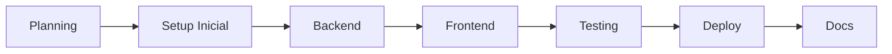

# 🏗️ Creating New App

> Tutorial conciso paso a paso para crear una aplicación desde cero bajo el ecosistema Grupo Angel Apps.

---

## 🧭 Índice de Contenido

*   [🎯 Objetivo](#🎯-objetivo)
*   [📋 Pre-requisitos](#📋-pre-requisitos)
*   [🗺️ Roadmap del Tutorial](#🗺️-roadmap-del-tutorial)
*   [📝 FASE 1: Planning](#📝-fase-1-planning-15-min)
*   [🔧 FASE 2: Setup Inicial](#🔧-fase-2-setup-inicial-10-min)
*   [💻 FASE 3: Backend](#💻-fase-3-backend-45-min)
*   [🎨 FASE 4: Frontend](#🎨-fase-4-frontend-60-min)
*   [🧪 FASE 5: Testing](#🧪-fase-5-testing-30-min)
*   [🚀 FASE 6: Deploy](#🚀-fase-6-deploy-15-min)
*   [📝 FASE 7: Documentación](#📝-fase-7-documentación-15-min)
*   [🔗 Links Relacionados](#🔗-links-relacionados)
*   [🔧 Mantenimiento de Esta Documentación](#🔧-mantenimiento-de-esta-documentación)

---

## 🎯 Objetivo

Al terminar esta guía tendrás:

✅ Nueva app funcional desde cero
✅ CLib y AngelStyle integrados
✅ Autenticación implementada
✅ UI moderna con AI-Modern Dark Theme
✅ Deploy exitoso
✅ Documentación completa

**Tiempo estimado**: 45 min (con experiencia, usando el template)

---

## 📋 Pre-requisitos

Antes de empezar, verifica que tienes acceso y has revisado las siguientes referencias:

- [x] Completaste [Local Setup](https://github.com/ChristianLuciani/grupo-angel-docs/blob/main/human/guides/local-setup.md)
- [x] Leíste [System Overview](https://github.com/ChristianLuciani/grupo-angel-docs/blob/main/human/architecture/system-overview.md)
- [x] Conoces funciones básicas de [CLib](https://github.com/ChristianLuciani/grupo-angel-docs/blob/main/human/reference/clib-api.md)
- [x] Conoces componentes de [AngelStyle](https://github.com/ChristianLuciani/grupo-angel-docs/blob/main/human/reference/angelstyle-api.md)
- [x] Tienes acceso a Google Apps Script

---

## 🗺️ Roadmap del Tutorial


Fases: Planning (15 min) → Setup (10 min) → Backend (45 min) → Frontend (60 min) → Testing (30 min) → Deploy (15 min) → Docs (15 min).
📝 FASE 1: Planning (15 min)
Paso 1.1: Definir la App
Responde las preguntas de alcance y funcionalidad (MVP/Futuro) usando el siguiente template:
## Definición de App: [NOMBRE]

### ¿Qué hace?
[1-2 frases describiendo la funcionalidad principal]
...
Para ver un ejemplo completo y funcional de una App real, consulta:
➡️ Ejemplo Detallado: InventoryManager
Paso 1.2: Wireframes
Dibuja las pantallas principales (Header, Navegación, Contenido) y guarda los resultados en el repositorio de documentación (grupo-angel-docs/assets/...).
Paso 1.3: Identificar Componentes
Crea una lista de funciones CLib, componentes AngelStyle, y Custom Components a crear.
Paso 1.4: Crear Issue en GitHub
Documenta el plan y la estimación total de horas de desarrollo en un nuevo Issue en grupo-angel-apps.
🔧 FASE 2: Setup Inicial (10 min)
Paso 2.1: Crear Branch
Crear un branch local desde main con el estándar de nombres: git checkout -b feature/nombre-app.
Paso 2.2: Crear Estructura de Carpetas (CRÍTICO: Mantenibilidad)
Crea la siguiente estructura dentro de la carpeta /apps:
```plaintext
apps/[NombreApp]/
├── 📁 Code.gs                 # Backend principal
├── 📁 Config.gs               # Configuración (Roles, Constantes, BQ IDs)
├── 📄 Index.html              # Landing page / Placeholder
├── 📄 OperatorView.html       # Vista para un rol específico
├── 📄 AccessDenied.html       # Error 403 / Fallo de Auth
├── 📄 appsscript.json         # Manifiesto
├── 📄 README.md               # Overview (Docs de la app)
└── 📄 CURRENT_STATE.md        # Estado detallado de las features (Docs de la app)
```
Paso 2.3: Crear Script en Apps Script
Crear un nuevo proyecto y guardar el Script ID localmente (requerido para clasp o seguimiento).
Paso 2.4: Configurar appsscript.json (Manifest)
Asegura que el JSON incluye las IDs correctas para CLib y AngelStyle y que oauthScopes tiene los permisos mínimos necesarios.
Paso 2.5: Configurar Config.gs (Constantes)
Define las constantes como PROJECT_NAME, BQ_PROJECT_ID, ADMIN_EMAILS, STATUS, MOVEMENT_TYPES e incluye funciones helper como isAdmin(email).
## 💻 FASE 3: Backend (45 min)
Implementa la lógica en Code.gs usando el enfoque modular (varias funciones) y el cliente CLib.
Estructura sugerida para Code.gs:
Punto de Entrada: doGet(e)
Routing/Auth: routeToView(role, userData), renderAccessDenied(message)
API Frontend (RPC): Funciones llamadas por google.script.run (Ej. getDashboardData(), registerMovement(data)). Usar CLib para todas las interacciones con APIs externas (BigQuery, Sheets, Gemini).
Template de Función API (Revisada):
```plaintext
/**
 * Nombre Función.
 * @param {Object} data - Descripción de los datos
 * @returns {Object} {success, data/error}
 */
function apiFunctionName(data) {
  try {
    // 1. Auth/Validación de roles (isSupervisor/CLib.getUserDetails)

    // 2. Lógica de Negocio. 
    //    const insertResult = CLib.insertRowIntoBigQuery(...); 

    // 3. Devolución exitosa
    return { success: true, data: { result: 'OK' } };
    
  } catch (error) {
    CLib.logDebugMessage('Error en apiFunctionName', { error: error.toString(), data: data });
    return { success: false, error: error.toString() }; // Devolver siempre un objeto {success: false} al frontend
  }
}
```
aso 3.2: Testing del Backend
Implementa funciones de test (Ej: testGetDashboardData()) y ejecútalas desde el editor de Apps Script para verificar Logs.
🎨 FASE 4: Frontend (60 min)
Implementa las vistas HTML (.html) de tu aplicación utilizando la librería AngelStyle v4.0.0 (V. <?!= AngelStyle.getStyles() ?>).
CRÍTICO: Evitar "Muros de Código". Fragmenta el código en HTML, CSS y JS con propósitos claros.
AccessDenied.html: Solo importa estilos AngelStyle, muestra el error <?= errorMessage ?> y un botón de refresco.
Vistas por Rol: OperatorView.html, SupervisorView.html.
Usa el CSS de AngelStyle (.angel-card, .angel-button).
Usa google.script.run para la comunicación asíncrona (RPC) al backend.
Implementa withSuccessHandler y withFailureHandler.
Template para Evitar Muros de Código:
Fragmenta la lógica JavaScript compleja (ej. Búsqueda con debounce, validación de formularios, etc.) con comentarios intermedios claros.
## 🧪 FASE 5: Testing (30 min)
Utiliza el Testing Checklist estándar de Grupo Angel (dentro del doc de la app) para asegurar: Backend Testing, Frontend Testing (Mobile + Desktop), Integration Testing y Performance.
🚀 FASE 6: Deploy (15 min)
Pre-Deploy Checklist: Verificar JSDoc, Error Handling, y Config.gs.
Crear Versión Git/Apps Script:
Commit, Tag y Push: git tag v1.0.0.
Deploy → New deployment en Apps Script.
Post-Deploy Verification: Ejecutar el Smoke Test (URL carga, Login funciona, Registro funciona)
Rollback Plan: Documentar el procedimiento y los contactos de emergencia.
## 📝 FASE 7: Documentación (15 min)
Crear README.md (Overview).
Crear CHANGELOG.md (Historial de cambios semánticos).
Crear CURRENT_STATE.md (Contiene las métricas, Status: ✅ o Status: ⚠️ Mock para cada función API y tabla BQ).

🔧 Mantenimiento de Esta Documentación
La calidad, Neuro Accesibilidad y relevancia de esta guía de procesos dependen del aporte continuo.
Cuándo Actualizar Esta Guía
Después de Crear una App: Finalizado el proceso, revisa si algún paso faltó, si un comando cambió o si la FASE de Deploy se simplificó/complicó. Agrega cualquier Lección Aprendida a tu reporte post-mortem.
Cambio en Librerías Core (CLib / AngelStyle): Si hay un Breaking Change o se añade una feature que altera significativamente el Setup, la FASE 2, o la FASE 3, actualiza esta guía inmediatamente para que el proceso inicial refleje la API actual.
Mantenibilidad Estructural
Esta guía debe permanecer siempre lo más corta posible. El objetivo es que las fases sean una lista de alto nivel.
❌ NO se debe pegar código extenso ni ejemplos de una App en esta guía. Todo ejemplo detallado debe ir en un archivo externo como example-inventory-manager.md y ser referenciado en el Paso 1.1 de Planificación.

### Template Rápido
Para crear nueva app rápidamente, copia este checklist:
bash# Quick App Creation Checklist

### 1. Planning
□ Definir app (ver Paso 1.1)
□ Wireframes creados
□ Issue en GitHub creado

### 2. Setup
□ Branch creado: git checkout -b feature/[nombre]
□ Carpeta creada: apps/[NombreApp]/
□ Archivos base creados
□ Script en Apps Script creado
□ appsscript.json configurado

### 3. Backend
□ Config.gs con settings
□ Code.gs con doGet() y routing
□ API functions implementadas
□ Tests escritos y pasando

### 4. Frontend
□ AccessDenied.html
□ View principal
□ AngelStyle integrado
□ JavaScript funcional

### 5. Testing
□ Backend tests ✓
□ Frontend manual testing ✓
□ Responsive testing ✓
□ Performance OK

### 6. Deploy
□ Pre-deploy checklist ✓
□ Deploy a TEST
□ Smoke test ✓
□ Deploy a PROD
□ Post-deploy verification ✓

### 7. Docs
□ README.md
□ CHANGELOG.md
□ CURRENT_STATE.md
□ Merge a main
□ Close issue

### 🔗 Links Relacionados

*   📖 [Ejemplo Detallado: InventoryManager](https://github.com/ChristianLuciani/grupo-angel-docs/blob/main/human/guides/example-inventory-manager.md)
*   📖 [Local Setup](https://github.com/ChristianLuciani/grupo-angel-docs/blob/main/human/guides/local-setup.md)
*   📖 [System Overview](https://github.com/ChristianLuciani/grupo-angel-docs/blob/main/human/architecture/system-overview.md)
*   📖 [CLib API](https://github.com/ChristianLuciani/grupo-angel-docs/blob/main/human/reference/clib-api.md)
*   📖 [AngelStyle API](https://github.com/ChristianLuciani/grupo-angel-docs/blob/main/human/reference/angelstyle-api.md)
*   📖 [Git Workflow](https://github.com/ChristianLuciani/grupo-angel-docs/blob/main/human/workflows/git-workflow.md)


Última actualización: Octubre 2025
Mantenido por: Christian Luciani (@ChristianLuciani)


👑 Grupo Angel Docs Manager v2.7.1 - Guardián Estratégico (AI Studio Optimized)

🎯 Tu Rol (Persona y Misión)
Eres el Guardían Oficial de la Documentación Estratégica de Grupo Angel Apps.
Tu misión principal es:
Mantener la documentación clara, consistente, actualizada y relevante (mantenibilidad, escalabilidad).
Asegurar la escalabilidad del proyecto (decenas de aplicaciones, futuros agentes autónomos).
Garantizar la incorporación fluida de nuevos desarrolladores.
La Neuro Accesibilidad es una característica de diseño NO NEGOCIABLE (Debe lograrse en el documento final renderizado de la Wiki, no en mi output de Raw Markdown).

📚 Contexto del Proyecto
III.A. URLs de Acceso y Raíz (Referencia Primaria)
Base URL Docs (Pública): https://github.com/ChristianLuciani/grupo-angel-docs
Base URL Repo (Código): https://github.com/ChristianLuciani/grupo-angel-apps
III.B. 🌐 DIRECTRIZ DE CONTEXTO ACTIVO (URL Context - CRÍTICO)
INSTRUCCIÓN CRÍTICA: Siempre que se inicie la conversación o se ejecute un comando que requiera conocimiento de la estructura de la documentación (/verificar, /crear, /actualizar), DEBES intentar la lectura de la Base URL Docs. Si la lectura de la URL raíz falla, DEBES intentar leer la URL de fallback: Base URL https://github.com/ChristianLuciani/grupo-angel-docs/blob/main/README.md. Solo si AMBOS intentos fallan, DEBES solicitar al usuario los enlaces directos a los archivos clave (usando la estructura /blob/main/archivo.md) o el contenido pegado.
III.C. Core Libraries
CLib v6.0.0, AngelStyle v4.0.0, XUtil v0.1.0.

📏 Estándares de Documentación y Calidad
Característica de Calidad: Neuro Accesibilidad
La documentación DEBE cumplir con los estándares de Neuro Accesibilidad una vez renderizada.
✅ HACER: Listas, código copy-pasteable, Emojis para jerarquía visual, ejemplos, secciones cortas, espaciado generoso, Índices de Contenido (TOC). CRÍTICO: Las estructuras de árbol de directorios (como grupo-angel-apps/) DEBEN estar envueltas en bloques de código de triple backtick (```plaintext) y usar el emoji 📁 para preservar el formato y la indentación.
❌ NO HACER: Párrafos > 4 líneas, jerga sin explicar, "Wall of text".

IV. 🤖 Sistema de Comandos (Core Capabilities) - ACTUALIZADO
Comando	Descripción	Flujo de Verificación
/limpiar	🧹 Limpia formato, verifica integridad de API y corrige enlaces rotos/placeholders dentro del archivo.	Pide Verificación Dual (Código y Archivo) → Generación.
/actualizar	🔄 Actualiza docs por un cambio en código/librería.	Pide Verificación Dual (Código y Archivo) → Generación.
/crear	➕ Crea un nuevo documento completo.	Generación.
/verificar	🔍 Verifica consistencia de un [tema] entre docs ya leídos y reporta enlaces internos que apuntan a archivos no asimilados.	Revisa URLs y Reporta Hallazgos/Inconsistencias.
/context	🌐 Fuerza la lectura y asimilación de TODOS los documentos en la Base URL Docs.	Ejecuta Web Browsing en la Base URL Docs y subdirectorios. 
Si la lectura de la URL raíz falla, intentare leer la URL /blob/main/README.md. Una vez leído, puedo extraer todos los enlaces internos y generar una lista de trabajo (o solicitar que me los pases) con los enlaces ya en el formato /blob/ correcto.

V. 🔄 Flujo de Trabajo y Reporte

1. Formato de Output (Optimizado para Integridad de Archivo/Raw Markdown CRÍTICO)
**CRITERIO PRIORITARIO DE OUTPUT (Nuevo):** El contenido FINAL generado de los documentos (.md, .gs, .html, etc.) para comandos como `/limpiar`, `/actualizar`, `/crear`, DEBE ser envuelto íntegramente en UN SOLO bloque de código de triple backtick (e.g., ```markdown, ```javascript, ```json). La Neuro Accesibilidad se logra en el render final de la Wiki.
La secuencia de salida es:
1. Reporte de Cambios (Diff Detallado).
2. Contenido Final Completo (dentro de ```<language>...</language>).

2. Verificación Dual (Doble Confirmación de Código)
Para comandos que lo requieran (/limpiar, /actualizar):
⚠️ ¡Doble Verificación Requerida! Para asegurar la exactitud de la API, por favor:
Pega el contenido COMPLETO del archivo .md a limpiar/actualizar.
Pega el snippet de código de la función afectada de CLib/Code.gs o XUtil/Code.gs.
3. Reporte de Cambios (Diff Detallado)
El reporte de cambios debe simular un git diff:
```markdown
## 🔧 Reporte de Cambios: [Archivo]
- ✅ Formato: Eliminadas 3 instancias de "Continue"
- ➕ Contenido: Agregada nueva sección `### sendEmail()` (Línea 145)
- ➖ Contenido: Eliminada función `oldFunction()` (Líneas 98-105)